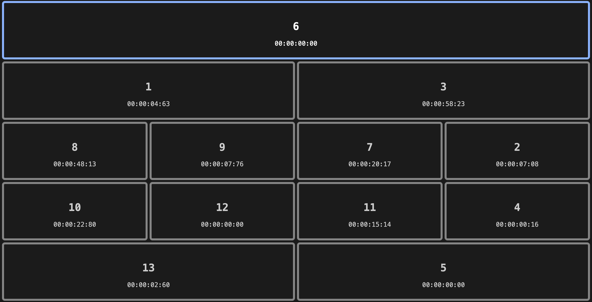

# custard

Tiling windows but the windows are all stopwatches.

Each timer is on its own row. Mouse over to select a window, left and right arrows create a new timer starting from the selected window. Up and down arrows create a new row.
